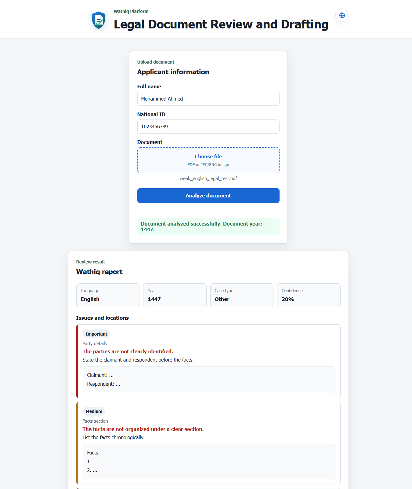
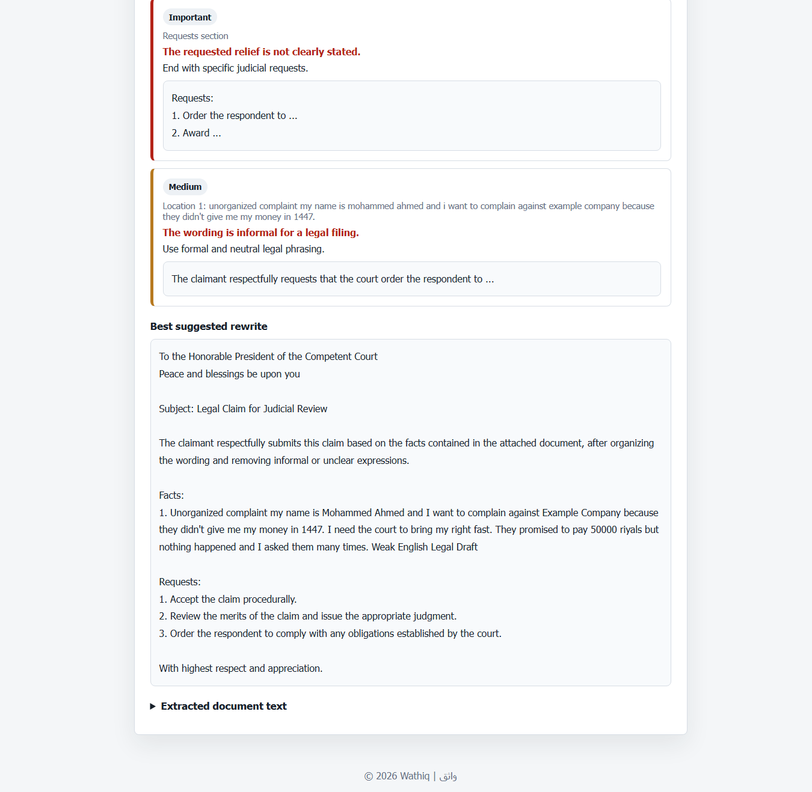

# Wathiq | واثق

<p align="center">
  
</p>

Wathiq is a legal document review assistant with an Arabic and English interface.

The project helps users upload a legal PDF or image, then it reviews the writing and shows:

- what is weak or unclear
- where the problem appears
- how to improve the wording
- a cleaner suggested legal draft

## Preview

English document review:





## What Wathiq Checks

Wathiq focuses on legal writing quality. It can detect problems like unclear party details, missing facts, weak requests, informal wording, and poor document organization.

It supports Arabic and English documents, and the web interface can switch between Arabic and English for easier use.

## Run The Project

Open PowerShell in the project folder:

```powershell
cd D:\guedr\Desktop\Adam\Projects\Hackathon_Project\thka-q9a
```

Start the server:

```powershell
.\.venv\Scripts\python.exe -m uvicorn main:app --app-dir . --host 127.0.0.1 --port 8000 --reload
```

Open:

```text
http://127.0.0.1:8000/Web_Interface/
```

## Use The App

1. Enter the applicant name.
2. Enter the national ID.
3. Upload a legal PDF or image.
4. Click `Analyze document` or `تحليل المستند`.
5. Read the review report and suggested rewrite.

## AI Model

The project can use Ollama for stronger review and rewriting:

```powershell
ollama pull qwen2.5:7b-instruct
```

If Ollama is not running, Wathiq still returns a basic review using fallback checks.

Developers can change the model in the code by editing this line in `main.py`:

```python
OLLAMA_MODEL = "qwen2.5:7b-instruct"
```

Use the exact name of an installed Ollama model, for example `qwen2.5:7b-instruct` or `llama3.1:8b`.

## Logs

Runtime logs are written to:

```text
logs/wathiq.log
```

The log includes request IDs, selected model, file processing status, OCR confidence, and errors.

## Tech

FastAPI, EasyOCR, PyMuPDF, OpenCV, Ollama, HTML, CSS, and JavaScript.

## Note

Wathiq is a prototype. Any generated legal draft should be reviewed by a legal professional before real use.
