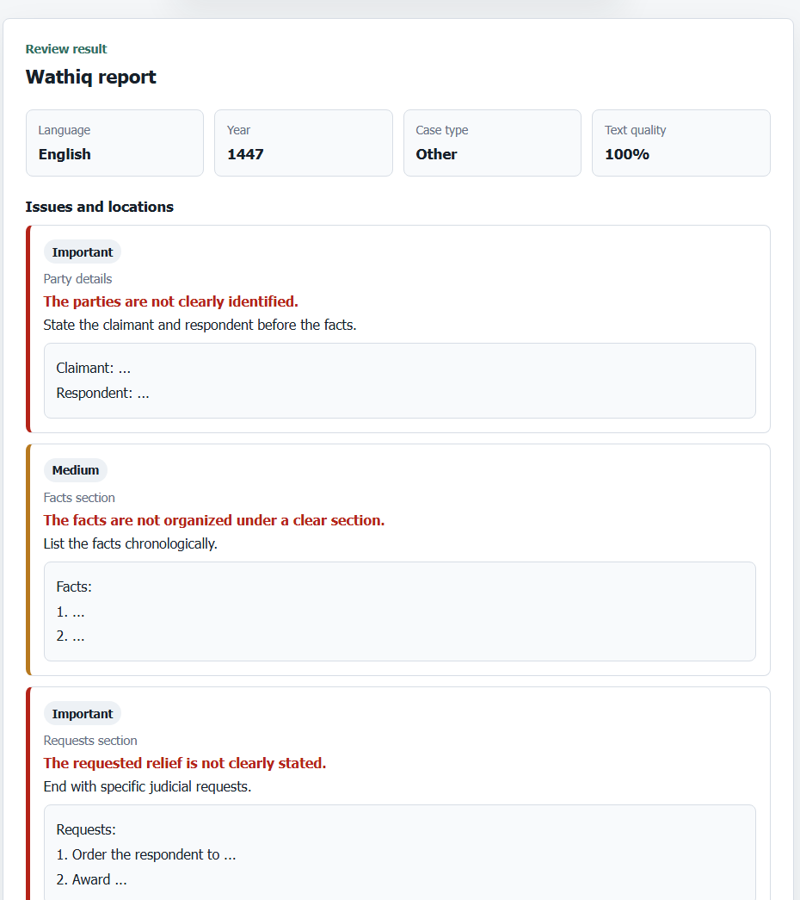
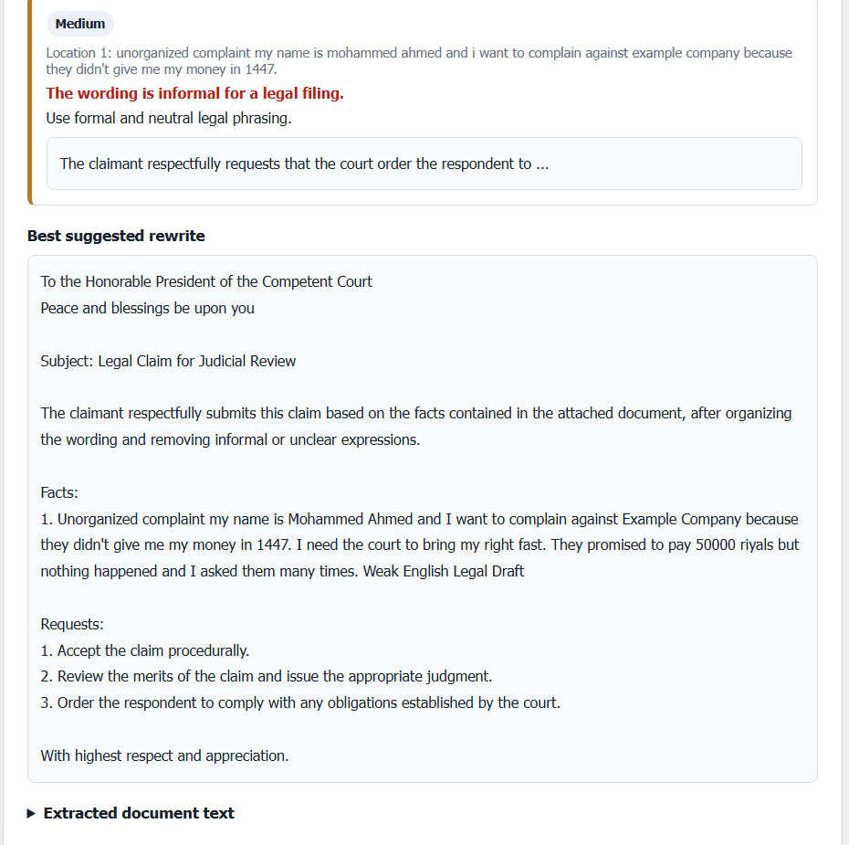

# Wathiq | واثق

<p align="center">
  
</p>

<p align="center">
  <strong>AI-powered legal document review for Arabic and English files.</strong>
</p>

<p align="center">
  
  
  
  
</p>

## ✨ Overview

Wathiq helps users upload legal PDFs or images, extract text, detect weak legal writing, and generate clearer suggested wording.

The interface supports Arabic and English for a smoother review experience.

## 🚀 Features

- Upload legal PDFs or images
- Extract text using PDF parsing and OCR
- Detect unclear parties, facts, requests, and informal wording
- Suggest stronger legal phrasing
- Review Arabic and English documents

## 🧠 AI Workflow

1. Extract text from the uploaded file.
2. Review and classify the legal content.
3. Generate a stronger draft with Ollama when available.
4. Use rule-based review if AI is offline.

## ⚙️ Installation

```bash
git clone https://github.com/qo43/thka-q9a.git
cd thka-q9a
pip install -r requirements.txt
```

Optional AI model:

```bash
ollama pull qwen2.5:7b-instruct
```

## ▶️ Usage

```bash
python main.py
```

Open:

```text
http://127.0.0.1:8000/Web_Interface/
```

To change the AI model, edit `OLLAMA_MODEL` in `App/app.py`.

## 📸 Demo

<p align="center">
  
  &nbsp;
  
</p>

## 📄 License

This project is licensed under the MIT License. See [LICENSE](LICENSE).

---

Wathiq is a prototype. Generated legal drafts should be reviewed by a legal professional before real use.
